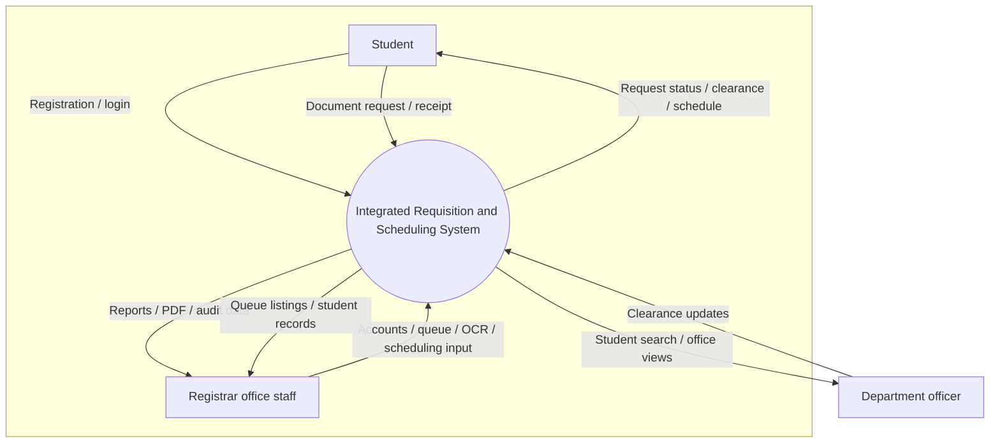
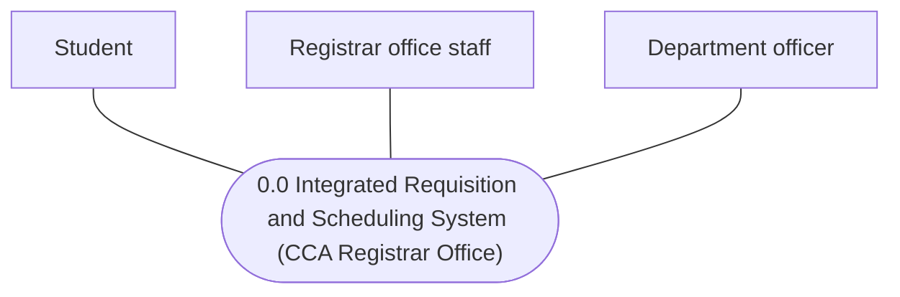
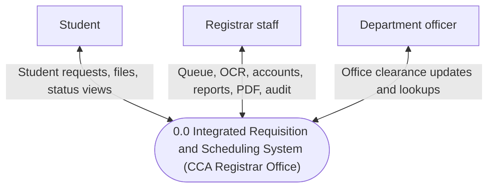

# Context diagram & use case diagram — CCA Registrar Office system

### Ready-made images (no Mermaid required)

| Diagram | PNG (insert into Word) | SVG (edit) |
|---------|------------------------|------------|
| Context / Level 0 DFD | [`diagrams/png/context-diagram-level0.png`](diagrams/png/context-diagram-level0.png) | [`diagrams/context-diagram-level0.svg`](diagrams/context-diagram-level0.svg) |
| Use case — **Student** only (stick figure + nine features) | [`diagrams/png/use-case-student-portal.png`](diagrams/png/use-case-student-portal.png) | [`diagrams/use-case-student-portal.svg`](diagrams/use-case-student-portal.svg) |
| Use case — **all roles** (Student + Registrar + Department officer) | [`diagrams/png/use-case-by-role.png`](diagrams/png/use-case-by-role.png) | [`diagrams/use-case-by-role.svg`](diagrams/use-case-by-role.svg) |

Regenerate PNG after SVG edits: `npm run diagrams:png` — see [`diagrams/README.md`](diagrams/README.md).

---

Below: optional **Mermaid** sources if you prefer regenerating from code ([mermaid.live](https://mermaid.live)).

**Remember**

- **Use case diagram:** People outside the system are drawn as **UML actors — the stick figure (“stickman”)**, never as plain rectangles. Each actor connects to the use cases they perform.
- **Context diagram (Level 0):** Shows **external entities** as **squares/rectangles** (terminators), **not** stick figures — that diagram is about **data flows**, not goals.

**Difference in one line:** **Context** = rectangles + data flows to **0.0**. **Use case** = **stick figure actors** + oval use cases inside the system boundary.

---

## 1. Context diagram (DFD Level 0)

One process **0.0** = the whole application. Three external entities: **Student**, **Registrar staff**, **Department officer**.

This matches the usual **0-level DFD / context diagram** rules: **one** central process, **no** internal detail, **data flows** on arrows (labels optional on the drawing or only in the narrative).

### Version C — railway-style **0-level DFD** (matches attached sample layout)

Same structure as a classic **Railway Reservation** context diagram: **rectangles** for terminators, **circle** for the system in the middle, **one named arrow per data flow**. Caption under your export: **0-LEVEL DFD**.


| Railway sample    | This system                                                          |
| ----------------- | -------------------------------------------------------------------- |
| Passenger         | **Student**                                                          |
| Admin             | **Registrar office staff**                                           |
| *(not in sample)* | **Department officer** (clearance office — shown below the main row) |


**Flows mirror the sample counts:** Student side — **two inputs**, **one output** (like *Reservation*, *Cancellation* → system and *Ticket Info* ← system). Registrar side — **one input**, **two outputs** (like *Up/Down Train Info* → system; *Reserve/Cancel Info*, *Passenger Info* ← system).




**0-LEVEL DFD** *(type this under the diagram in Word/PowerPoint like the railway slide.)*

---

### Version A — clean lines (flows explained in your paper)




### Version B — labeled arrows (optional)




**Suggested narrative (when arrows are unlabeled — Versions A or B):**

- **Student ↔ 0.0:** registration, login, document requests and uploads, tracking, clearance view, password change.
- **Registrar ↔ 0.0:** login, user accounts, request queue (search, OCR, status, scheduling), clearances overview, reports/PDF, audit, password change.
- **Department officer ↔ 0.0:** login, student search for own office, clearance updates, password change.

---

## 2. Use case diagram — **actors are stick figures (stickmen)**

In UML, an **actor** is the **stick figure** beside the system box. In Mermaid `useCaseDiagram`, declare each human role with `**actor`** — that renders as the **stickman**, not a box.

Use cases are **ovals** inside the **system boundary** (`package` / `rectangle`). Export from [mermaid.live](https://mermaid.live) is **black and white** by default (like your Vocalingua sample).

**Do not** draw student/registrar/officer as rectangles here — that notation belongs to the **context diagram (§1)** only.

### Primary example — **same structure as Vocalingua Mobile App** (your reference)

This is the **use case** diagram pattern from your sample (**black and white**, **stick figure** actor, **rectangle** system boundary):


| Vocalingua Mobile App (your image)                              | CCA Registrar (this diagram)                  |
| --------------------------------------------------------------- | --------------------------------------------- |
| **Student User** (stick figure, **left** of box)                | **Student** (`actor` → stickman in Mermaid)   |
| Large oval **Use Vocalingua** (main goal)                       | **Use student portal**                        |
| **Solid** line: actor → main oval                               | `STU --> UC0`                                 |
| **Solid** lines: main oval → each small oval on the **right** (like Vocalingua Admin Web) | `UC0 --> UCx` (same style as your reference; optional `<<include>>` label omitted for clarity) |
| Title on **top** of boundary box                                | `rectangle "…"` label                         |
| Nine detail ovals stacked vertically                            | Nine student features below                   |


**Nine** sub-use cases (same count as Vocalingua’s nine functions):

```mermaid
usecaseDiagram
  left to right direction

  actor "Student" as STU

  rectangle "CCA Registrar Student Portal" {
    usecase "Use student portal" as UC0
    usecase "Register account (school email)" as UC1
    usecase "Log in" as UC2
    usecase "View student dashboard" as UC3
    usecase "Submit document request (upload receipt)" as UC4
    usecase "Track document request status" as UC5
    usecase "View clearance status" as UC6
    usecase "View release slot / schedule" as UC7
    usecase "Change password" as UC8
    usecase "Manage profile (name / session)" as UC9
  }

  STU --> UC0

  UC0 --> UC1
  UC0 --> UC2
  UC0 --> UC3
  UC0 --> UC4
  UC0 --> UC5
  UC0 --> UC6
  UC0 --> UC7
  UC0 --> UC8
  UC0 --> UC9
```


**Note:** Mermaid may auto-place ovals; when **drawing by hand** for your paper, copy **Vocalingua**: main oval **center-left** inside the box, nine ovals in a **column on the right**, **solid** lines from **Use student portal** to each small oval (and solid actor associations).

---

### Full diagram — every actor linked to each use case (flat list)

Registrar staff = former admin (`registrar` role). All associations are **solid** lines (no central aggregate).

```mermaid
usecaseDiagram
  left to right direction

  actor "Student" as STU
  actor "Registrar staff" as REG
  actor "Department officer" as OFF

  package "CCA Registrar System" {
    usecase "Register student account" as UC1
    usecase "Log in and change password" as UC2
    usecase "Submit document request and receipt" as UC3
    usecase "Track document request status" as UC4
    usecase "View own clearance status" as UC5
    usecase "Manage user accounts" as UC6
    usecase "Search and process request queue" as UC7
    usecase "Run OCR and assign release slot" as UC8
    usecase "View and search student clearances" as UC9
    usecase "View reports and export PDF" as UC10
    usecase "View audit log" as UC11
    usecase "Search students for office" as UC12
    usecase "Update clearance for own office" as UC13
  }

  STU --> UC1
  STU --> UC2
  STU --> UC3
  STU --> UC4
  STU --> UC5

  REG --> UC2
  REG --> UC6
  REG --> UC7
  REG --> UC8
  REG --> UC9
  REG --> UC10
  REG --> UC11

  OFF --> UC2
  OFF --> UC12
  OFF --> UC13
```


---

More diagrams (DFD Level 1, ERD): see `**SYSTEM_DIAGRAMS.md**` in this folder.