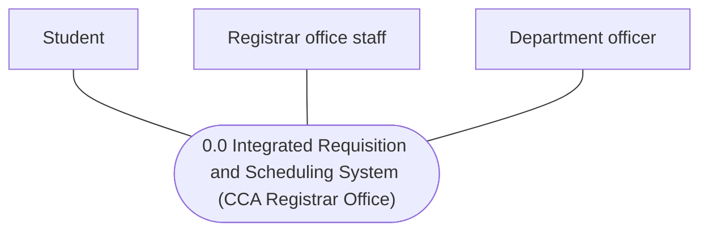
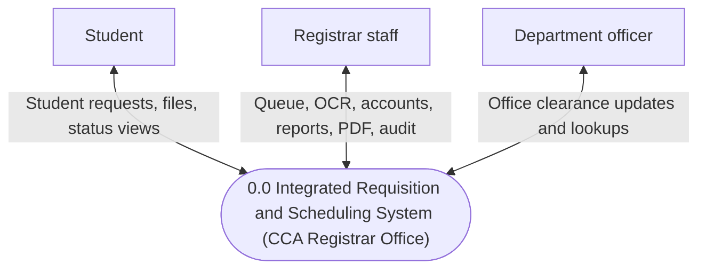
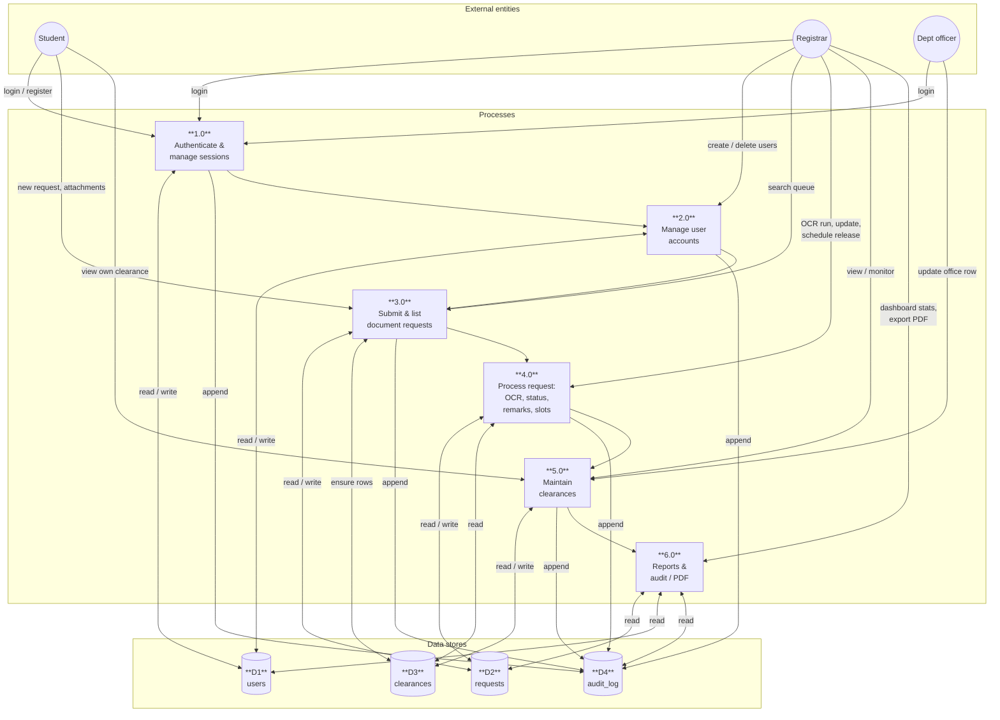
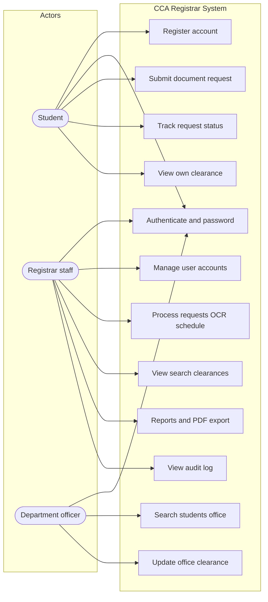
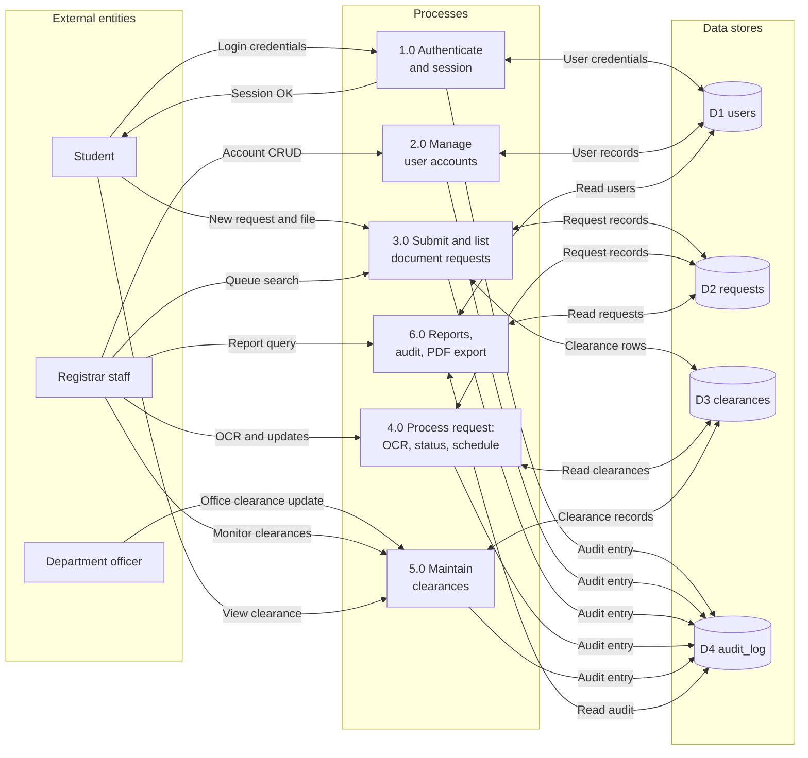
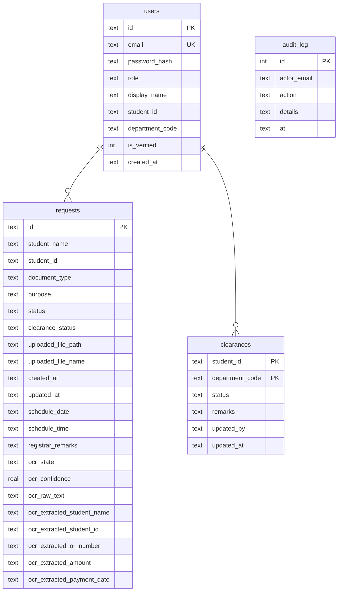

# System diagrams — Integrated Requisition and Scheduling System (CCA Registrar Office)

These diagrams match the current web application (Node.js, Express, EJS, SQLite). Render them in any **Mermaid-compatible** viewer (GitHub, GitLab, VS Code preview, [mermaid.live](https://mermaid.live)).

---

## 1. Context diagram (Level 0 — DFD context)

### How this differs from a **use case** diagram


|                    | **Context diagram (Level 0)**                                                     | **Use case diagram (UML)**                                                             |
| ------------------ | --------------------------------------------------------------------------------- | -------------------------------------------------------------------------------------- |
| **Shows**          | The **whole system as one process (0.0)** and **who** is outside it               | **Goals** the system supports (**use cases** as ovals) and **who** triggers them       |
| **People / roles** | Drawn as **external entities** (rectangles / terminators) — **not** stick figures | Drawn as **actors** (stick figures in UML; in Mermaid `useCaseDiagram` use `actor`) |
| **Flows**          | **Data flows** (inputs/outputs) between each entity and **0.0**                   | **Associations** (lines) from actor to use case; optional `<<include>>` / `<<extend>>` |
| **Detail**         | **No** internal processes, **no** data stores                                     | **No** data stores; may group many use cases in one system boundary                    |


Use **§1** for a minimal Level 0 (clean lines). Use **§1A** if you want **labels on the arrows** like some textbook examples. Use **§3** and **§3A** for use cases (including stick-figure style in **§3A**).

---

Classic **single system process (0.0)** with **external entities** only. Arrows are **unlabeled** on the diagram (flows are described in the narrative below).




**Narrative (data flows, not shown on lines):**

- **Student ↔ 0.0:** registration, login, document requests and attachments, request tracking, clearance view, password change.
- **Registrar staff ↔ 0.0:** login, user account management, request queue (search, OCR, status, scheduling, remarks), clearance monitoring, reports and PDF export, audit views, password change.
- **Department officer ↔ 0.0:** login, search students for own office, update clearance row for that office, password change.

All interaction is via **HTTPS / web browser** to the deployed application.

### 1A. Optional sample — context with **labeled data flows**

Some instructors want **short flow names** on the arrows (still Level 0: one process, no internal breakdown).




---

## 2. Data flow diagram — Level 1

Major processes and data stores inside the system. Flows are labeled with the main data moved.




**Process notes**


| ID  | Name                    | Typical triggers                                                             |
| --- | ----------------------- | ---------------------------------------------------------------------------- |
| 1.0 | Authenticate & sessions | Login, logout, password change; `users` for credentials                      |
| 2.0 | Manage user accounts    | Registrar creates student / department / registrar staff accounts            |
| 3.0 | Submit & list requests  | Student submits request + receipt file; registrar lists/filters queue        |
| 4.0 | Process request         | OCR on upload, edit extracted fields, set status, pick release slot, remarks |
| 5.0 | Maintain clearances     | Officers set Pending/Signed/Not Signed; students and registrar read               |
| 6.0 | Reports & audit         | Aggregated stats, audit trail, PDF export                                    |


---

## 3. Use case diagram

**Reminder — use case = stick figure actors:** In UML, **people** outside the system are **stick figures (actors)**, not rectangles. In Mermaid use **`actor`** so each role renders as the **stickman**. **Rectangles / terminators** belong to the **context diagram (§1)** only — there you show **data flows**, not goals.

Registrar staff = same access as former admin (`registrar` role in the database). The **flowchart** version below is the most reliable in Mermaid Live and VS Code. An optional `**useCaseDiagram`** follows (uses `package` for the system boundary). For **stick-figure actors + ovals**, prefer **§3A** below.

**Recommended (stable in Mermaid Live / VS Code):**




**Optional (`useCaseDiagram` — use if your tool renders it):**

```mermaid
usecaseDiagram
  left to right direction
  actor Student
  actor "Registrar staff" as Registrar
  actor "Department officer" as Officer

  package "CCA Registrar System" {
    usecase "Register account" as UC1
    usecase "Authenticate and password" as UC2
    usecase "Submit document request" as UC3
    usecase "Track request status" as UC4
    usecase "View own clearance" as UC5
    usecase "Manage user accounts" as UC6
    usecase "Process requests OCR schedule" as UC7
    usecase "View search clearances" as UC8
    usecase "Reports and PDF export" as UC9
    usecase "View audit log" as UC10
    usecase "Search students office" as UC11
    usecase "Update office clearance" as UC12
  }

  Student --> UC1
  Student --> UC2
  Student --> UC3
  Student --> UC4
  Student --> UC5

  Registrar --> UC2
  Registrar --> UC6
  Registrar --> UC7
  Registrar --> UC8
  Registrar --> UC9
  Registrar --> UC10

  Officer --> UC2
  Officer --> UC11
  Officer --> UC12
```


---

## 3A. Sample — use case with **UML actors** (stick figures)

In Mermaid’s `useCaseDiagram`, `actor` is drawn as the **stick figure** (same idea as your “Admin User” / “Student User” samples). Paste into [mermaid.live](https://mermaid.live) to export PNG/SVG.

```mermaid
usecaseDiagram
  left to right direction

  actor "Student" as STU
  actor "Registrar staff" as REG
  actor "Department officer" as OFF

  package "CCA Registrar System" {
    usecase "Register student account" as UC1
    usecase "Log in and change password" as UC2
    usecase "Submit document request and receipt" as UC3
    usecase "Track document request status" as UC4
    usecase "View own clearance status" as UC5
    usecase "Manage user accounts" as UC6
    usecase "Search and process request queue" as UC7
    usecase "Run OCR and assign release slot" as UC8
    usecase "View and search student clearances" as UC9
    usecase "View reports and export PDF" as UC10
    usecase "View audit log" as UC11
    usecase "Search students for office" as UC12
    usecase "Update clearance for own office" as UC13
  }

  STU --> UC1
  STU --> UC2
  STU --> UC3
  STU --> UC4
  STU --> UC5

  REG --> UC2
  REG --> UC6
  REG --> UC7
  REG --> UC8
  REG --> UC9
  REG --> UC10
  REG --> UC11

  OFF --> UC2
  OFF --> UC12
  OFF --> UC13
```


**Tip:** If your school wants `<<include>>` / `<<extend>>`, add only where you have a real rule (e.g. “Process queue” **includes** “Authenticate”); otherwise keep associations simple like the samples above.

---

## 3B. Sample — **Data flow diagram Level 1** (external entities, processes, data stores, **labeled flows**)

This mirrors textbook DFDs (like your **Admin** / **User** Level 1 samples): **rectangles** = processes, **open-ended store** style is approximated with **cylinder nodes** `[( … )]` (common stand-in for “data store” in Mermaid). Arrows show **direction of data** with **labels**.




**Hand-drawing note:** On paper, redraw **data stores** as **open rectangles** (two horizontal lines) with `D1` … `D4` on the left bar; keep the **same labels** on arrows.

---

## 4. Entity relationship diagram (ERD)

Logical ERD aligned with SQLite tables in `src/db.js`. `requests.student_id` and `clearances.student_id` align with `users.student_id` for student accounts (enforced in application logic; not declared FKs in SQLite). **Relationship lines have no labels** on the diagram.




**Relationship summary**

- **users → requests:** one student (`role = student`, `student_id` set) may have many `requests` rows sharing the same `student_id`.
- **users → clearances:** clearance rows are keyed by `student_id`; created/ensured per student.
- **clearances.department_code:** aligns with department officer `users.department_code` (Library, Finance, MISSO, SASO, Guidance, Extension).
- **audit_log:** records actions (login, create user, clearance update, etc.); `actor_email` often matches `users.email`.

---

## Export tips

- **PNG/SVG:** Paste each Mermaid block into [mermaid.live](https://mermaid.live) and export.
- **Word/LibreOffice:** Export PNG from mermaid.live and insert into your capstone document.
- **LaTeX:** Use `mermaid-cli` (`mmdc`) in CI to compile this file to PDF or images if needed.

If your school requires **Yourdon/DeMarco** DFD notation on paper, use the Level-1 structure above as a checklist and redraw circles (processes), open rectangles (data stores), and squares (external entities) by hand from the same labels.